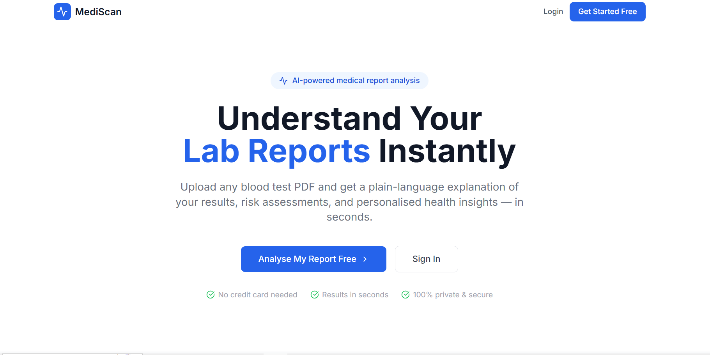
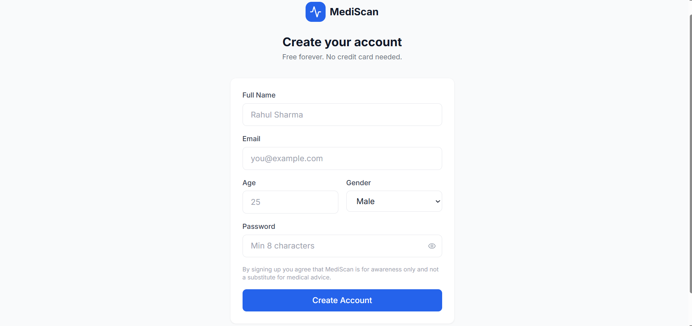
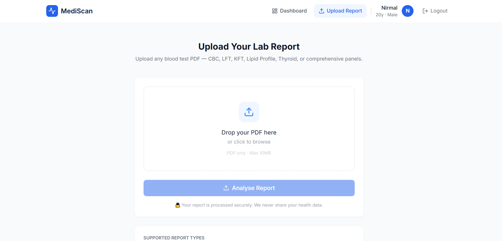
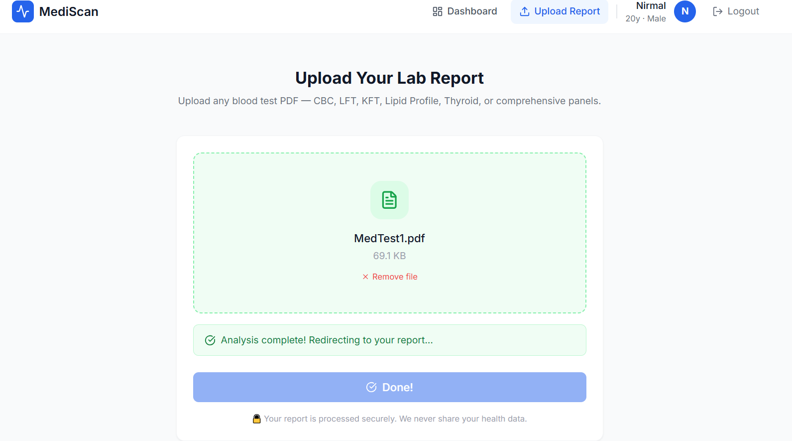
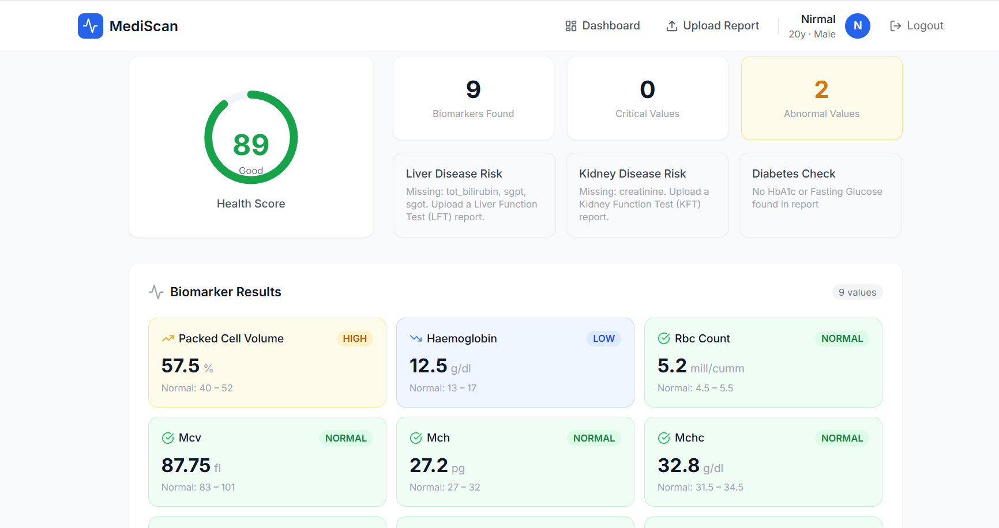
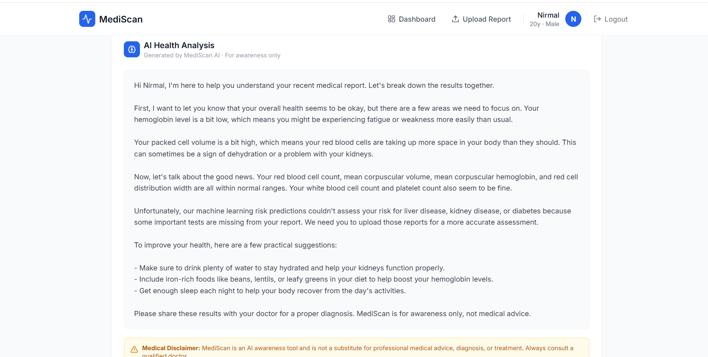
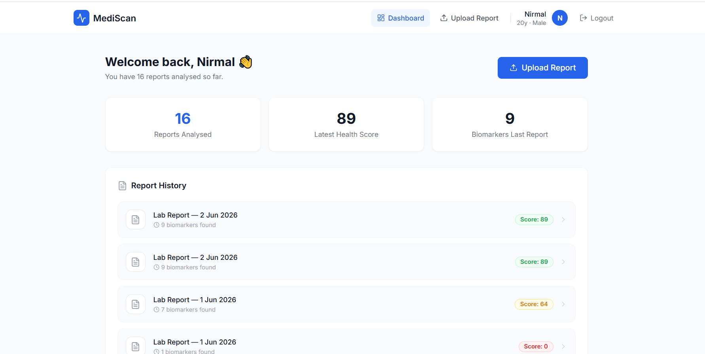

# MediScan — AI Medical Report Analyst

> Upload any Indian blood test PDF → get plain-language explanation → AI risk analysis → track your health over time.



---

## 📌 Table of Contents

- [Overview](#overview)
- [Live Demo](#live-demo)
- [Screenshots](#screenshots)
- [Features](#features)
- [How It Works](#how-it-works)
- [Tech Stack](#tech-stack)
- [Project Structure](#project-structure)
- [ML Models](#ml-models)
- [Datasets Used](#datasets-used)
- [Setup & Installation](#setup--installation)
- [Environment Variables](#environment-variables)
- [API Endpoints](#api-endpoints)
- [Supported Lab Formats](#supported-lab-formats)
- [Known Limitations](#known-limitations)
- [Future Improvements](#future-improvements)
- [Author](#author)
- [Disclaimer](#disclaimer)

---

## Overview

MediScan is a full-stack AI product that makes medical lab reports understandable for every Indian. Most people receive blood test PDFs from labs like SRL, Dr Lal PathLabs, Metropolis, or Drlogy — and have no idea what the numbers mean.

MediScan solves this by:

- Automatically extracting all biomarker values from any uploaded PDF
- Comparing each value against WHO and ICMR reference ranges
- Running trained ML models to assess liver and kidney disease risk
- Detecting diabetes risk using WHO/ADA clinical thresholds
- Generating a personalised plain-language health analysis using Groq LLaMA 3
- Tracking biomarker trends across multiple reports over time

No manual data entry. No medical knowledge required. Upload your PDF and understand your health in seconds.

---

## Screenshots

### Landing Page


### Sign Up / Login


### Upload Report


### Report Analysis


### Health Score & Risk Predictions


### AI Health Analysis


### Report History Dashboard


---

## Features

### Core Features
- **Smart PDF Parsing** — Dual-engine pipeline using pdfplumber for digital PDFs and PaddleOCR with image preprocessing for scanned or phone photo PDFs
- **Biomarker Extraction** — Regex + synonym dictionary recognises 30+ biomarkers across 6+ Indian lab report formats with dotted abbreviations, varied units, and multilingual headers
- **Reference Range Flagging** — Every biomarker flagged as NORMAL / LOW / HIGH / CRITICAL using WHO and ICMR reference ranges adjusted for gender
- **ML Risk Scoring** — Two XGBoost models predict liver disease and kidney disease probability from blood test values
- **Diabetes Detection** — Rule-based detection using official WHO/ADA HbA1c and fasting glucose thresholds — more accurate than any trained model for this use case
- **AI Plain-Language Analysis** — Groq LLaMA 3 generates personalised explanation grounded in PubMed medical literature via RAG
- **Trend Tracking** — Upload multiple reports over time and see if any biomarker is rising or falling dangerously
- **Health Score** — Single 0–100 score computed from all biomarker statuses for quick health overview

### Product Features
- JWT-based user authentication (signup / login / secure sessions)
- User profile stores age and gender — no manual input on every upload
- Full report history with one-click access to any past analysis
- Medical disclaimer on every screen — responsible AI design
- Personalised AI analysis addresses user by name

---

## How It Works

```
User uploads PDF
      │
      ▼
┌─────────────────────────────┐
│     PDF Parser               │
│  pdfplumber → digital PDF   │
│  PaddleOCR  → scanned PDF   │
│  Image preprocessing        │
└──────────┬──────────────────┘
           │ raw text
           ▼
┌─────────────────────────────┐
│   Biomarker Extractor        │
│  Regex + synonym dictionary │
│  Word-boundary matching     │
│  Plausibility validation    │
└──────────┬──────────────────┘
           │ structured JSON
           ▼
┌─────────────────────────────┐
│   Risk Classifier            │
│  Reference range comparison │
│  Unit scale normalization   │
│  NORMAL/LOW/HIGH/CRITICAL   │
└──────────┬──────────────────┘
           │ flagged biomarkers
     ┌─────┴──────┐
     ▼            ▼
┌─────────┐  ┌────────────────────┐
│XGBoost  │  │  Diabetes Rules    │
│Liver    │  │  HbA1c + Glucose   │
│Kidney   │  │  WHO/ADA thresholds│
└────┬────┘  └─────────┬──────────┘
     └────────┬─────────┘
              │ predictions
              ▼
┌─────────────────────────────┐
│   Groq RAG Explainer         │
│  ChromaDB PubMed retrieval  │
│  LLaMA 3 generation         │
│  Personalised + cited       │
└──────────┬──────────────────┘
           │ complete analysis
           ▼
┌─────────────────────────────┐
│   MySQL Database             │
│  Save report + biomarkers   │
│  Save predictions            │
│  Save AI analysis            │
└──────────┬──────────────────┘
           │
           ▼
    React Frontend
  Health Score Gauge
  Biomarker Cards
  Risk Predictions
  AI Analysis Text
  Report History
```

---

## Tech Stack

### Backend
| Technology | Purpose |
|---|---|
| Python 3.11 | Core language |
| FastAPI | REST API framework |
| SQLAlchemy | ORM for MySQL |
| PyMySQL | MySQL driver |
| pdfplumber | Digital PDF text extraction |
| PyMuPDF (fitz) | PDF to image conversion |
| PaddleOCR | OCR for scanned/photo PDFs |
| Pillow | Image preprocessing |
| XGBoost | Liver and kidney disease models |
| joblib | Model serialisation |
| LangChain | RAG pipeline orchestration |
| ChromaDB | Vector database for PubMed embeddings |
| Groq API | LLaMA 3 inference for explanations |
| python-jose | JWT token authentication |
| bcrypt | Password hashing |
| Uvicorn | ASGI server |

### Frontend
| Technology | Purpose |
|---|---|
| React 18 | UI framework |
| React Router v6 | Client-side routing |
| Tailwind CSS v3 | Utility-first styling |
| Axios | HTTP client |
| Lucide React | Icon library |
| Context API | Auth state management |

### Database
| Technology | Purpose |
|---|---|
| MySQL 8.0 | Primary relational database |
| 6 normalised tables | Users, Reports, Biomarkers, Predictions, Analyses, Reference Ranges |

### ML & Data
| Dataset | Model |
|---|---|
| ILPD — Indian Liver Patient Dataset (Kaggle) | XGBoost Liver Disease Classifier |
| UCI Chronic Kidney Disease Dataset (Kaggle) | XGBoost Kidney Disease Classifier |
| PubMed Open Access Abstracts | ChromaDB RAG knowledge base |
| WHO / ICMR Reference Guidelines | Rule-based Risk Classifier |

---

## Project Structure

```
mediscan/
├── backend/
│   ├── main.py                     # FastAPI app entry point
│   ├── config.py                   # Environment config
│   ├── database.py                 # MySQL connection
│   ├── models.py                   # SQLAlchemy table models
│   ├── schemas.py                  # Pydantic request/response schemas
│   ├── auth.py                     # JWT authentication
│   ├── pipeline/
│   │   ├── ocr_parser.py           # PDF parsing + OCR + preprocessing
│   │   └── biomarker_extractor.py  # Regex extraction + validation
│   ├── ml/
│   │   ├── predictor.py            # XGBoost inference + risk scoring
│   │   ├── liver_model.pkl         # Trained liver disease model
│   │   ├── kidney_model.pkl        # Trained kidney disease model
│   │   ├── liver_features.json     # Feature order for liver model
│   │   ├── kidney_features.json    # Feature order for kidney model
│   │   ├── liver_medians.json      # Training medians for imputation
│   │   └── kidney_medians.json     # Training medians for imputation
│   ├── rag/
│   │   └── groq_explainer.py       # ChromaDB retrieval + Groq generation
│   ├── routes/
│   │   ├── auth_routes.py          # /auth/signup, /auth/login, /auth/me
│   │   └── report_routes.py        # /reports/analyse, /reports/history
│   └── data/
│       └── biomarker_synonyms.json # 30+ biomarker name variants
├── frontend/
│   ├── src/
│   │   ├── App.jsx                 # Routing + protected routes
│   │   ├── api/client.js           # Axios instance + interceptors
│   │   ├── context/AuthContext.jsx # Auth state provider
│   │   ├── components/Navbar.jsx   # Navigation component
│   │   └── pages/
│   │       ├── Landing.jsx         # Marketing landing page
│   │       ├── Login.jsx           # Login page
│   │       ├── Signup.jsx          # Registration page
│   │       ├── Upload.jsx          # PDF upload page
│   │       ├── Report.jsx          # Report analysis results
│   │       └── Dashboard.jsx       # Report history
│   ├── tailwind.config.js
│   └── index.html
├── notebooks/
│   ├── 01_liver_model_training.ipynb
│   └── 02_kidney_model_training.ipynb
├── .env
├── requirements.txt
└── README.md
```

---

## ML Models

### Model A — Liver Disease Risk Classifier
| Detail | Value |
|---|---|
| Algorithm | XGBoost |
| Dataset | ILPD — Indian Liver Patient Dataset |
| Rows | 583 |
| Features | Age, Gender, Total Bilirubin, Alkaline Phosphatase, SGPT, SGOT, Total Proteins, Albumin, A/G Ratio |
| Target | Binary (liver patient / healthy) |
| Validation | 5-fold cross-validation |
| Output | Probability 0.0 – 1.0 → LOW / MODERATE / HIGH risk |

### Model B — Kidney Disease Risk Classifier
| Detail | Value |
|---|---|
| Algorithm | XGBoost |
| Dataset | UCI Chronic Kidney Disease Dataset |
| Rows | 400 |
| Features | Age, Haemoglobin, Serum Creatinine, Blood Urea, Sodium, Potassium, Packed Cell Volume, WBC Count |
| Target | Binary (CKD / not CKD) |
| Validation | 5-fold cross-validation |
| Output | Probability 0.0 – 1.0 → LOW / MODERATE / HIGH risk |

### Diabetes Detection — Rule-Based (No ML)
Uses WHO/ADA clinical diagnostic thresholds directly:

| HbA1c | Status |
|---|---|
| < 5.7% | Normal |
| 5.7 – 6.4% | Pre-diabetic |
| ≥ 6.5% | Diabetic risk |

| Fasting Glucose | Status |
|---|---|
| < 100 mg/dL | Normal |
| 100 – 125 mg/dL | Pre-diabetic |
| ≥ 126 mg/dL | Diabetic risk |

> Rule-based is intentionally used here because these thresholds are the WHO definition of diabetes — no ML model can improve on the clinical ground truth.

---

## Datasets Used

| Dataset | Source | Used For |
|---|---|---|
| Indian Liver Patient Dataset (ILPD) | [Kaggle](https://www.kaggle.com/datasets/zubairdhuddi/indian-liver-patient-dataset) | Liver model training |
| Chronic Kidney Disease Dataset | [Kaggle](https://www.kaggle.com/datasets/mansoordaku/ckdisease) | Kidney model training |
| PubMed Open Access Abstracts | [PubMed FTP](https://ftp.ncbi.nlm.nih.gov/pub/pmc/oa_bulk/) | RAG knowledge base |
| WHO / ICMR Reference Ranges | WHO Guidelines + ICMR Reports | Risk classification rules |

---

## Setup & Installation

### Prerequisites
- Python 3.11+
- Node.js 22.12+
- MySQL 8.0
- Git

### Step 1 — Clone the repository

```bash
git clone https://github.com/yourusername/mediscan.git
cd mediscan
```

### Step 2 — Create virtual environment

```bash
python -m venv venv

# Windows
venv\Scripts\activate

# Mac/Linux
source venv/bin/activate
```

### Step 3 — Install backend dependencies

```bash
pip install fastapi uvicorn python-multipart pdfplumber pymupdf
pip install paddleocr paddlepaddle pillow numpy
pip install sqlalchemy pymysql python-jose[cryptography] bcrypt
pip install xgboost scikit-learn joblib pandas
pip install groq langchain chromadb sentence-transformers
pip install python-dotenv
```

### Step 4 — Create MySQL database

Open MySQL and run:

```sql
CREATE DATABASE mediscan;
```

### Step 5 — Configure environment variables

Create `backend/.env`:

```env
GROQ_API_KEY=your_groq_api_key_here
```

Update `backend/database.py` with your MySQL credentials:

```python
DB_USER     = "root"
DB_PASSWORD = "your_mysql_password"
DB_HOST     = "localhost"
DB_PORT     = "3306"
DB_NAME     = "mediscan"
```

### Step 6 — Add trained model files

Place the following files inside `backend/ml/`:

```
liver_model.pkl
kidney_model.pkl
liver_features.json
kidney_features.json
liver_medians.json
kidney_medians.json
```

> To train the models yourself, open and run the notebooks in the `notebooks/` folder.

### Step 7 — Start the backend

```bash
cd backend
uvicorn main:app --reload
```

Backend runs at `http://localhost:8000`
API docs available at `http://localhost:8000/docs`

### Step 8 — Install and start the frontend

```bash
cd frontend
npm install
npm run dev
```

Frontend runs at `http://localhost:5173`

---

## Environment Variables

| Variable | Location | Description |
|---|---|---|
| `GROQ_API_KEY` | `backend/.env` | Free API key from console.groq.com |
| `DB_PASSWORD` | `backend/database.py` | Your MySQL root password |
| `SECRET_KEY` | `backend/auth.py` | JWT signing secret — change in production |

---

## API Endpoints

### Authentication
| Method | Endpoint | Description |
|---|---|---|
| POST | `/auth/signup` | Create new account |
| POST | `/auth/login` | Login and get JWT token |
| GET | `/auth/me` | Get logged-in user profile |

### Reports
| Method | Endpoint | Description |
|---|---|---|
| POST | `/reports/analyse` | Upload PDF and get full analysis |
| GET | `/reports/history` | Get all past reports for logged-in user |
| GET | `/reports/{report_id}` | Get full details of a specific report |

### Health
| Method | Endpoint | Description |
|---|---|---|
| GET | `/health` | API health check |

---

## Supported Lab Formats

MediScan has been tested on the following Indian lab report formats:

| Lab | Format | Status |
|---|---|---|
| SRL Diagnostics | Digital PDF | ✅ Supported |
| Dr Lal PathLabs | Digital PDF | ✅ Supported |
| Metropolis Healthcare | Digital PDF | ✅ Supported |
| Drlogy Pathology Lab | Digital PDF | ✅ Supported |
| Pathkind Diagnostics | Digital PDF (multi-page) | ✅ Supported |
| Generic Indian CBC | Scanned / Photo PDF | ✅ Supported |
| Old handwritten reports | Phone photo PDF | ⚠️ Partial — depends on image quality |

---

## Known Limitations

- **Phone photo PDFs** — Very dark, angled, or blurry photos may not extract correctly. Digital PDFs from lab email/WhatsApp always give best results.
- **Handwritten reports** — Not supported. OCR is trained on printed text.
- **Non-English reports** — Reports with Hindi or Gujarati test names not extracted (English values are still found if present).
- **Small model datasets** — Liver model trained on 583 rows, kidney on 400 rows. Predictions should be treated as risk indicators, not diagnoses.
- **Missing features** — If a report does not contain the required biomarkers for a model, that model is skipped and the reason is shown to the user.

---

## Future Improvements

- [ ] Trend detection alerts — notify user when a biomarker rises over 3+ consecutive reports
- [ ] Liver Function Test (LFT) report page with detailed enzyme analysis
- [ ] Vitamin D and B12 deficiency tracking
- [ ] Hindi language support for report parsing
- [ ] WhatsApp integration — send weekly health summary
- [ ] ABDM (Ayushman Bharat Digital Mission) health record compliance
- [ ] Doctor finder integration by city and speciality
- [ ] Mobile app (React Native)

---

## Author

**Nirmal Patel**
B.Sc. + M.Sc. (CA & IT) — Ganpat University, Gujarat

- 📧 nilupatel02005@gmail.com
- 💼 [LinkedIn](https://www.linkedin.com/in/nirmal-patel-184500251/)
- 🌐 [Portfolio](https://nirmalpatel-02.github.io/MyPortfolio/)
- 💻 [GitHub](https://github.com/NirmalPatel-02)

---

## Disclaimer

> **MediScan is an AI-powered awareness tool and is NOT a substitute for professional medical advice, diagnosis, or treatment.**
>
> All risk scores and health analyses generated by MediScan are for informational purposes only. Always consult a qualified and licensed medical doctor before making any health decisions based on your lab results.
>
> MediScan does not store or share your health data with any third party. All report data is encrypted and associated only with your account.
